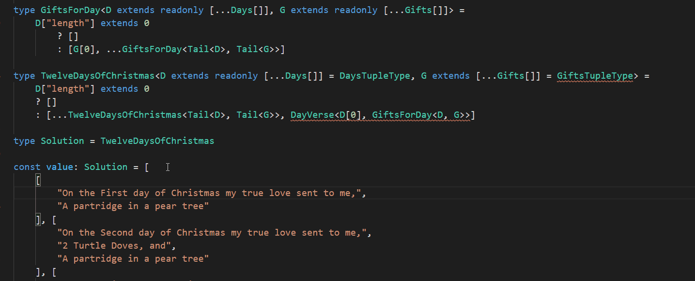

# 12 Days of Christmas using TypeScript Type System and Compiler

This repository is just a bit of fun that explores
pushing the advanced features of TypeScript's type system
to the limits by using it to generate a type for the lyrics
of [The 12 Days of Christmas](https://en.wikipedia.org/wiki/The_Twelve_Days_of_Christmas_(song)).

There is an associated [TypeScript 4.1 blog post](https://instil.co/blog/crazy-powerful-typescript-41/)
that covers some of the features that are used. 

Note that we are not executing code or using data, we're only
defining types, but the types are compiled so that only
the lyrics is a valid value for the type.

It utilises advanced TypeScript features,

- Const Assertions (3.4+)
- Template Literal Types (4.1+)
- Conditional Types
- Mapped Types
- Variadic Tuple Types (4.0+)
- Recursive Conditionals (4.1+)

The motivation was really the inclusion of Recursive Conditional Types and
Template Literal Types in TypeScript 4.1.

## Setup

You will need to ensure you are using TypeScript 4.1 (currently RC)
so perform an `npm install` and set your IDE to use the workspace
version of TypeScript.

If you build, the code WILL give errors. This is just a bit of fun
and pushes the compiler further than you would in normal production
code so you will see lots of errors like,

- `Type instantiation is excessively deep and possibly infinite.`
- `Excessive stack depth comparing types ...`

I could make it a bit more complex and count the recursive loops
and bomb out after a certain number but haven't done it.

## Viewing the Solution

The easiest way to see the result is to open `tests.ts` in Visual
Studio Code and hold `Ctrl` while hovering over `Solution`.

## More TypeScript

I work for a software development company called [Instil Software](https://instil.co) 
which also provides training. We train teams all over the world on all sorts of topics
(not just TypeScript). 

Check out our [TypeScript course promo video](https://www.youtube.com/watch?v=NWKzh6So1Cw)
and some of our courses,

- [TypeScript](https://instil.co/courses/typescript-introduction/)
- [React with TypeScript](https://instil.co/courses/react-with-typescript/)
- [Angular](https://instil.co/courses/introduction-to-angular/)
- [All Courses](https://instil.co/training/)

## References

Lot's of inspiration from [ts-toolbelt](https://github.com/millsp/ts-toolbelt).
